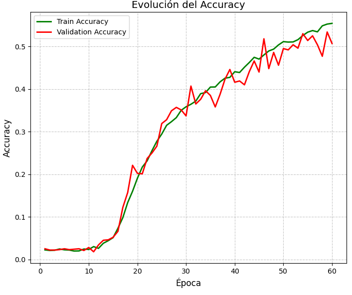
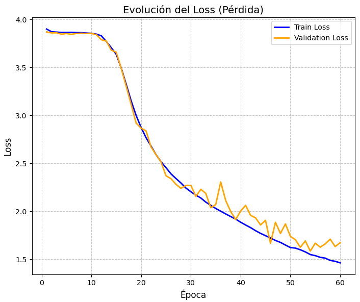

# Vision Transformer (ViT) para Clasificación de Caracteres EMNIST

## Descripción

Este proyecto implementa un *Vision Transformer (ViT)* desarrollado completamente desde cero utilizando *NumPy, sin emplear frameworks de Deep Learning como TensorFlow o PyTorch. El modelo fue entrenado sobre el conjunto de datos **EMNIST Balanced, utilizando una arquitectura híbrida que incorpora una **Red de Kohonen (SOM)* para el Patch Embedding y una *Modern Hopfield Network* como mecanismo de atención.

El entrenamiento genera un archivo .npz con todos los pesos aprendidos y un archivo .csv con las métricas obtenidas durante cada época.

---

# Arquitectura del modelo

Imagen 28x28
      │
      ▼
División en Patches (7x7)
      │
      ▼
Patch Embedding (SOM + Proyección Lineal)
      │
      ▼
Positional Embedding + CLS Token
      │
      ▼
Layer Normalization
      │
      ▼
Modern Hopfield Layer
      │
      ▼
Residual Connection
      │
      ▼
MLP
(Linear → ReLU → Linear)
      │
      ▼
Layer Normalization
      │
      ▼
Clasificador Lineal
      │
      ▼
Softmax

---

# Dataset

- *Dataset:* EMNIST Balanced
- *Número de clases:* 47
- *Tamaño de imagen:* 28 × 28 píxeles
- *Número de patches:* 16
- *Tamaño de cada patch:* 7 × 7 píxeles

---

# Funcionamiento del Vision Transformer

A diferencia de las Redes Neuronales Convolucionales (CNN), el Vision Transformer procesa una imagen como una secuencia de pequeños bloques llamados *patches*.

Cada imagen se divide en regiones de tamaño fijo:

$$
N=\frac{H\times W}{P^2}
$$

donde:

- \(H\) = altura
- \(W\) = ancho
- \(P\) = tamaño del patch

En este proyecto:

- Imagen: *28×28*
- Patch: *7×7*
- Total de patches: *16*

---

# Patch Embedding mediante SOM (Kohonen)

En lugar de utilizar una capa lineal tradicional para generar los embeddings, se emplea una *Self Organizing Map (SOM)*.

Durante el entrenamiento cada neurona ajusta sus pesos según:

$$
W_i(t+1)=W_i(t)+\eta \cdot h_{bi}(t)\cdot(x-W_i(t))
$$

donde:

- \(W_i\) son los pesos
- \(\eta\) es la tasa de aprendizaje
- \(h_{bi}\) representa la función de vecindad
- \(x\) corresponde al patch de entrada

Posteriormente, estas activaciones son proyectadas al espacio de embeddings mediante una capa lineal.

---

# Positional Embedding

Debido a que el Transformer no conoce la posición de cada patch, se añade un vector posicional:

$$
Z = E + P
$$

donde:

- \(E\) = embedding del patch
- \(P\) = embedding posicional

Además se incorpora un *CLS Token*, utilizado posteriormente para realizar la clasificación.

---

# Modern Hopfield Layer

La atención del modelo fue reemplazada por una *Modern Hopfield Network*, la cual calcula similitudes entre patrones almacenados y los nuevos embeddings.

La matriz de atención se obtiene mediante:

$$
A=\text{Softmax}\left(\frac{QK^T}{\sqrt{d}}\right)
$$

Posteriormente se recupera el nuevo estado mediante:

$$
H=A\cdot V
$$

Este mecanismo permite recuperar patrones relevantes de memoria durante la clasificación.

---

# MLP

Después de la capa Hopfield, únicamente el *CLS Token* atraviesa un perceptrón multicapa compuesto por:

- Linear
- ReLU
- Linear

La función de activación utilizada es *ReLU*:

$$
ReLU(x)=\max(0,x)
$$

Esta función introduce no linealidad y evita que el modelo aprenda únicamente relaciones lineales.

---
# Layer Normalization

Antes de cada bloque principal se aplica **Layer Normalization**, calculada como:

$$
LN(x)=\gamma\frac{x-\mu}{\sqrt{\sigma^2+\epsilon}}+\beta
$$

Esta técnica estabiliza el entrenamiento y acelera la convergencia del modelo.

---

# Función de pérdida

La clasificación utiliza la función **Softmax Cross Entropy**.

Softmax:

$$
P_i=\frac{e^{z_i}}{\sum_j e^{z_j}}
$$

Cross Entropy:

$$
L=-\log(P_{real})
$$

---

# Archivos generados

- `modelo_final.npz` → pesos entrenados del modelo.
- `metricas_entrenamiento.csv` → Accuracy, Loss y Precisión por época.

---

# Tecnologías utilizadas

- Python
- NumPy
- Gzip
- CSV

---

# Resultados del entrenamiento

El modelo fue entrenado utilizando el conjunto de datos **EMNIST Balanced** durante **10 épocas**, obteniendo una precisión de clasificación superior al **98 %** en el conjunto de validación.

Durante el entrenamiento se registraron las siguientes métricas:

- Accuracy de entrenamiento
- Accuracy de validación
- Training Loss
- Validation Loss

Los pesos finales del modelo fueron almacenados en un archivo `.npz`, el cual contiene todos los parámetros necesarios para reconstruir el Vision Transformer sin necesidad de volver a entrenarlo.

## Accuracy

*Figura 1. Evolución del Accuracy durante el entrenamiento.*

---

## Loss

*Figura 2. Evolución de la función de pérdida durante el entrenamiento.*

Durante las primeras épocas se observa una rápida disminución de la pérdida, mientras que el accuracy aumenta progresivamente hasta estabilizarse, indicando que el modelo converge correctamente y logra una buena capacidad de generalización.

# Autor

Proyecto desarrollado como implementación desde cero de un **Vision Transformer híbrido (Kohonen + Modern Hopfield)** para la clasificación de caracteres del conjunto de datos **EMNIST Balanced**.
